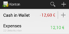
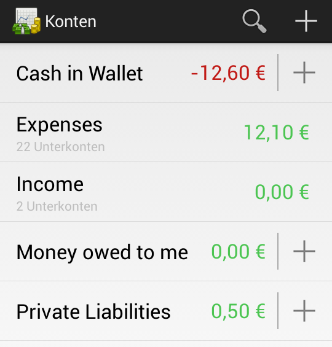
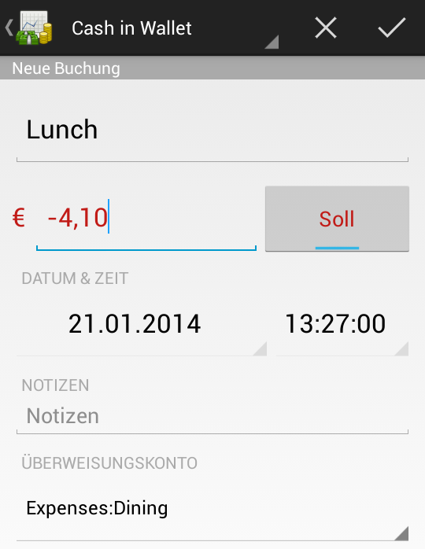
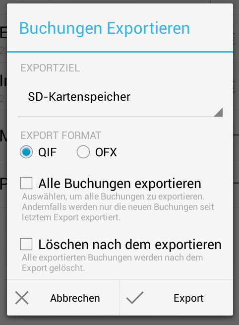
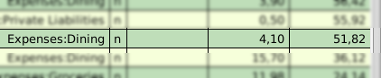

.. title: GnuCash Mobile to Desktop Walkthrough
.. slug: gnucash-mobile-to-desktop-walkthrough
.. date: 2014/01/22 22:05:39
.. tags: gnucash
.. link: 
.. description: 
.. type: text

As shown in :doc:`my last GnuCash post <synchronizing-gnucash-mobile-with-gnucash-desktop>`, I wrote a small helper script to ease
expense tracking with GnuCash mobile. This post should provide a step by step example of how the daily workflow would look like.

.. TEASER_END

First I installed `GnuCash mobile`_ on the Android phone via Google Play Store.
On the other end I already have a running GnuCash_ on Linux (I'm using Ubuntu, so it's ``sudo apt-get install gnucash``).
Accounts and transactions are already configured and used in GnuCash desktop.

For GnuCash mobile I could either import my desktop account tree or create them separately. In the end I imported the complete account tree into the Android app and deleted a lot of accounts.
Most accounts simply make no sense to have on the phone (e.g. mortgage liabilities).
I only kept the accounts interesting for mobile usage and removed intermediate "folder" accounts:

* Cash in Wallet

* Expenses

  * Auto

  * Dining

  * Groceries

  * ...

* Income

  * Gifts

  * ...

* Money owed to me

* Private Liabilities

My top-level mobile accounts look like this:

Now I can start tracking expenses. To record a new transaction I click on the small plus symbol next to my "Cash in Wallet" account.
Going out for lunch looks like this:

So how do I get these transactions back into GnuCash desktop?
First of all I can export all (new) transactions from GnuCash mobile to QIF_ files on the phone's flash disk.
For this I have to click the menu button and select "Export transactions...":

Sadly importing these files would usually require copying them to my desktop computer and importing them from GnuCash's main menu.
To automate this (a bit) I wrote a small Python script (see :doc:`my last blog post <synchronizing-gnucash-mobile-with-gnucash-desktop>`).
After connecting my phone via USB I just have to run it:

.. code:: bash

   ~/gnucash-qif-import/import.py -f ~/my-accounts.gnucash mtp:.*.qif

The above command will scan for QIF files on the phone's flash disk, download new ones and import them into my main GnuCash file ``my-accounts.gnucash``.

Eventually I can open GnuCash desktop to check that the transaction was correctly imported:

Apart from actually tracking the expenses, this workflow still requires some manual steps:

* Clicking on "Export transactions..." on the Android phone
* Connecting the device via USB
* Triggering the script run

Maybe some day I will fix the first item to happen automatically (i.e. patch Android app). The second item is fine with me as I have to charge the phone anyway.
The third item could also be fixed by some udev_ rule triggering the ``import.py`` script.

.. _GnuCash mobile: https://play.google.com/store/apps/details?id=org.gnucash.android
.. _GnuCash: http://www.gnucash.org/
.. _QIF: https://en.wikipedia.org/wiki/Quicken_Interchange_Format
.. _udev: https://en.wikipedia.org/wiki/Udev
