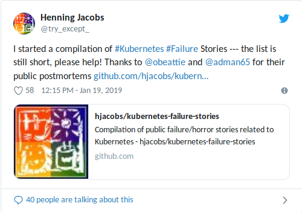
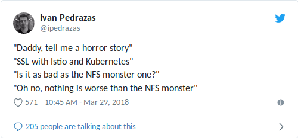

.. title: Kubernetes Failure Stories
.. slug: kubernetes-failure-stories
.. date: 2019/01/20 11:26:00
.. tags: kubernetes
.. link:
.. description:
.. previewimage: ../galleries/kubernetes-logo.png
.. type: text

.. image:: ../galleries/kubernetes-logo.png
   :class: left

I started to compile a `list of public failure/horror stories related to Kubernetes <https://github.com/hjacobs/kubernetes-failure-stories>`_.
It should make it easier for people tasked with operations to find outage reports to learn from.

.. TEASER_END

Since we started with Kubernetes at Zalando in 2016, we collected many internal postmortems.
Docker bugs (`daemon unresponsive <https://github.com/moby/moby/issues/28889>`_, process stuck in pipe wait, ..) were a major pain point in the beginning, but Docker itself has become more mature and did not bite us recently.
The biggest chunk of problems can be attributed to the nature of distributed systems and "cascading failures", e.g. a Kubernetes API server outage should not affect running workloads, but `it did <https://github.com/zalando/skipper/issues/406>`_,
or see `our recent CoreDNS incident <https://twitter.com/sszuecs/status/1085292025895940097>`_.

We shared some of our incidents and Kubernetes failures in talks:

* `Running Kubernetes in Production: A Million Ways to Crash Your Cluster - DevOpsCon Munich 2018 <https://www.slideshare.net/try_except_/running-kubernetes-in-production-a-million-ways-to-crash-your-cluster-devopscon-munich-2018>`_
* `Running Kubernetes in Production: A Million Ways to Crash Your Cluster - Container Camp UK 2018 <https://www.slideshare.net/try_except_/running-kubernetes-in-production-a-million-ways-to-crash-your-cluster-container-camp-uk>`_
* `Kubernetes on AWS at Zalando: Failures & Learnings - DevOps NRW meetup 2018 <https://www.slideshare.net/try_except_/kubernetes-on-aws-at-zalando-failures-learnings-devops-nrw>`_

My main motivation for giving such talks about failures is that **I want to hear more of them myself!** Nordstrom's `talk "101 Ways to Crash Your Cluster" on KubeCon 2017 <https://www.youtube.com/watch?v=xZO9nx6GBu0>`_ was my inspiration
(as you can even see from the similarity in talk titles ;-)). I hope to see more people share their postmortems and give failure talks.
Monzo's transparency and `public postmortem <https://community.monzo.com/t/resolved-current-account-payments-may-fail-major-outage-27-10-2017/26296/95>`_ is a great service to the community and should be something we all strive towards.

Compiling a List of Kubernetes Failure Stories
----------------------------------------------

On my quest to find more public Kubernetes failure stories, I discovered that it's either really hard to find them (or my web search skills are lacking) or that there are only very few published. Search terms I tried on `DuckDuckGo <https://duckduckgo.com/>`_ and Google:

* `kubernetes outage <https://duckduckgo.com/?q=kubernetes+outage>`_
* `kubernetes incident <https://duckduckgo.com/?q=kubernetes+incident>`_
* `kubernetes postmortem <https://duckduckgo.com/?q=kubernetes+postmortem>`_
* `kubernetes failure <https://duckduckgo.com/?q=kubernetes+failure>`_
* `kubernetes crash <https://duckduckgo.com/?q=kubernetes+crash>`_

I also tried various combinations and "k8s", "kube-dns", and "kube-proxy" instead of "kubernetes". This did not yield many results and most of the pages I found are somehow more "success" stories and highlight how to prevent outages from happening.
That's boring!

The `compiled list of Kubernetes Failure Stories I found so far is available on GitHub <https://github.com/hjacobs/kubernetes-failure-stories>`_.
I hope to see many contributions to the list from the community, but I guess the hard part is encouraging people to publish their outage reports.
**Please contribute to the list** by opening an issue, creating a PR or `reaching out to me on Twitter <https://twitter.com/try_except_>`_!

What's Next
-----------

I'll be on a meetup in Hamburg in February to talk more about Kubernetes failures, please join if you can: `"Let’s talk about Failures with Kubernetes!" meetup Hamburg <https://www.meetup.com/inovex-Meetup-Hamburg/events/258065688/>`_.

At Zalando, we will try to publish a write-up of our recent Kubernetes DNS incident and hopefully find a way to more systematically share postmortems with the community.
Sharing our failure stories is something we can all benefit from to harden our setups and help prioritize upstream issues.
"Production-readiness" is, from my perspective, still something mostly discussed behind closed doors (i.e. inside organizations) --- e.g. `CPU CFS quota behavior and latency impact <https://www.slideshare.net/try_except_/optimizing-kubernetes-resource-requestslimits-for-costefficiency-and-latency-highload>`_ is not well known and not mentioned in `the docs <https://kubernetes.io/docs/tasks/configure-pod-container/assign-cpu-resource/>`_.
Let's change that!

BTW: I'm also still looking for the first Istio failure talk..

Some recommended talks/reads for Kubernetes in production:

* `Hardening Kubernetes Setups: War Stories from the Trenches of Production - Giant Swarm - KubeCon North America 2018 <https://www.youtube.com/watch?v=MTHj0_NdeeM>`_: not very deep, but mentions some good points to look out for
* `90 days of AWS EKS in Production - Graham Moore - blog post 2018 <https://kubedex.com/90-days-of-aws-eks-in-production/>`_: many tunable system parameters (which you probably should not copy 1-1 without understanding them), mentions important ``kube-dns`` scaling
* `Optimizing Kubernetes Resource Requests/Limits for Cost-Efficiency and Latency - Zalando - Highload++ 2018 <https://www.youtube.com/watch?v=eBChCFD9hfs>`_: why you should consider disabling CPU throttling (CFS quota) in your cluster(s)
* `Kubernetes the very hard way at Datadog <https://www.youtube.com/watch?v=2dsCwp_j0yQ>`_: good insights of common (DNS issues, OOM) and less common (e.g. Datadog uses containerd and IPVS) challenges
* `Inside Kubernetes Resource Management (QoS) – Mechanics and Lessons from the Field - Michael Gasch - KubeCon Europe 2018 <https://www.youtube.com/watch?v=8-apJyr2gi0>`_: fundamental information on how Kubernetes resources work

UPDATE 2019-01-28
-----------------

I did a brief `write-up on what happend after posting this blog article on Hacker News </posts/tale-of-a-hacker-news-post.html>`_.
