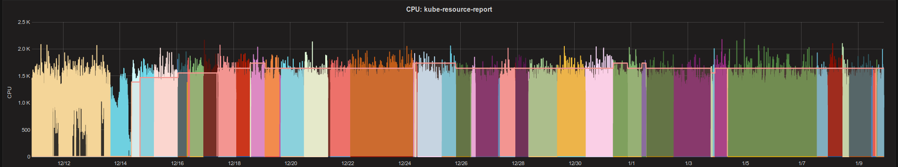
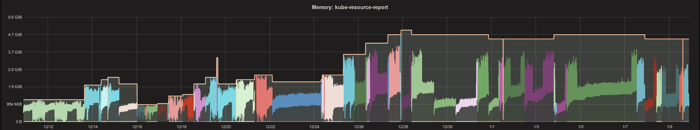

.. title: One month of Kubernetes VPA
.. slug: one-month-of-kubernetes-vertical-pod-autoscaler-vpa
.. date: 2019/01/09 20:57:00
.. tags: kubernetes
.. link:
.. description:
.. type: text

.. image:: ../galleries/kubernetes-vpa-memory.thumbnail.png
   :class: left

This is a small report of what I observed after one month of using the `Kubernetes Vertical Pod Autoscaler (VPA)`_ for a simple application (only a single pod).

.. TEASER_END

The `Kubernetes Resource Report`_ (kube-resource-report) is a rather simple Python script to generate a static HTML report of Kubernetes resource requests, usage, and slack costs.
It collects all nodes, pods, and metrics (CPU/memory usage) and renders a bunch of Jinja2 templates.

I deployed kube-resource-report together with a nginx container (to serve the generated HTML) as a single pod in `our Zalando environment <https://github.com/zalando-incubator/kubernetes-on-aws>`_.
By nature of the script, it scales purely vertically: more clusters, nodes, and pods will lead to an increase in the size of the in-memory data structure. Initially I deployed kube-resource-report with static CPU and memory requests and had to tweak them multiple times.
The third time I was fed up and decided to try out the recently deployed VPA infrastructure. Switching to VPA was very easy: I just had to add the proper CRD for it:

.. code-block:: yaml

    apiVersion: autoscaling.k8s.io/v1beta1
    kind: VerticalPodAutoscaler
    metadata:
      name: kube-resource-report
    spec:
      selector:
        matchLabels:
          application: kube-resource-report
      updatePolicy:
        updateMode: Auto

That was very easy for me (as `the VPA infrastructure <https://github.com/zalando-incubator/kubernetes-on-aws/tree/dev/cluster/manifests/01-vertical-pod-autoscaler>`_ was already set up by our Zalando Kubernetes team) and it immediately worked!

But how does it look like after 30 days of running with VPA? Here the CPU and memory graphs (click on the image to see original size):

CPU
---

As you can see, I specifically set low CPU requests before switching to VPA as I decided that the (background) container generating the HTML can have low CPU priority (we `disabled CPU CFS quotas in all our Zalando clusters <https://www.youtube.com/watch?v=eBChCFD9hfs&t=1520>`_, so no CPU throttling is happening).

Memory
------

The picture is much clearer here: memory is not a compressible resource, so we need to ensure that our memory request/limit always matches our real demand. The memory usage grows over time, but also drops again at some point in time.
The VPA seems to nicely follow the usage curve until ca. 28th of December, afterwards the requests (== limit) stay high, but actual memory usage is much lower for days.

The different colors in above graphs indicate different pods. Kubernetes Resource Report runs with a single pod and VPA will create a new one for changes in resource requests.
Kubernetes resource requests/limits are immutable on a pod, changing them leads to recreation of the pod.

Summary
-------

* VPA is simple to use (from the perspective of an application developer). Adding a ``VerticalPodAutoscaler`` CRD YAML with ``updateMode: Auto`` is all what is needed.
* VPA adequately increases CPU/memory requests, i.e. no more manual increase of resource requests in YAML files.
* We can see some resource slack, even with VPA (does not decrease memory requests even if memory usage is low for 24h).
* VPA needs to recreate pods to adapt resources (and I would not have tried VPA with a critical application).
* My non-critical and non-horizontal-scalable app works with VPA, I haven't tested anything more complicated.

I haven't digged deeper into the VPA and how it behaves over time, so that's it for now with my first observations.

**Do you want to learn more about Zalando's Kubernetes setup?** Take a peek at `our many public presentations (slides and videos) <https://kubernetes-on-aws.readthedocs.io/en/latest/admin-guide/public-presentations.html>`_!

.. _Kubernetes Vertical Pod Autoscaler (VPA): https://github.com/kubernetes/autoscaler/tree/master/vertical-pod-autoscaler
.. _Kubernetes Resource Report: https://github.com/hjacobs/kube-resource-report
