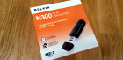

.. link: 
.. description: 
.. tags: xubuntu
.. date: 2014/05/31 14:30:18
.. title: USB WLAN on Xubuntu 13.10
.. slug: usb-wlan-on-xubuntu-1310

In order to connect my old desktop PC (now connected to TV screen), I had to buy either a long ugly CAT cable, buy two powerline adapters or buy a WLAN adapter.
I decided to go for a wireless USB adapter.

.. TEASER_END

Linux users know that buying hardware can be a pain as many consumer devices do not have proper drivers for Linux (yet).
So the first thing I did was searching for compliant USB WLAN adapters. The german Ubuntuusers Wiki has a `good page about WLAN cards and USB sticks`_.
In the end there were not many "hard" recommendations I found, so I tried it the other way around: browsing the local PC store I checked every stick for compatibility.

In the end I bought the `Belkin N300 Wireless USB Adapter (F7D2101QDE)`_ for 14.99 EUR at my local store.
The `F7D2101QDE has a RTL8192SU chipset`_ and works out of the box on my Xubuntu 13.10 (I haven't upgraded to 14.04 yet as network connectivity was missing ;-)).

I feared the hassle with Linux drivers, but my new USB WLAN adapter works like a charm. I just had to enter the WPA2 key and was ready to go.
After doing a fairly big Xubuntu upgrade (13.10 to 14.04) via the Belkin adapter, I cannot see any issues (like connection drops) so far.

.. _good page about WLAN cards and USB sticks: http://wiki.ubuntuusers.de/WLAN/Karten
.. _Belkin N300 Wireless USB Adapter (F7D2101QDE): http://www.belkin.com/de/F7D2101-Belkin/p/P-F7D2101/
.. _F7D2101QDE has a RTL8192SU chipset: http://wiki.ubuntuusers.de/WLAN/Karten/Belkin
