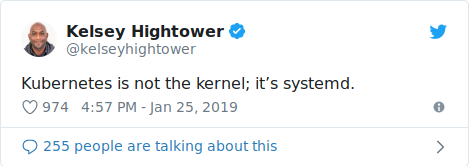
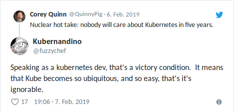

.. title: Why Kubernetes?
.. slug: why-kubernetes
.. date: 2019/03/25 11:36:00
.. tags: kubernetes
.. link:
.. description:
.. previewimage: ../galleries/kubernetes-logo.png
.. type: text

There was a recent blog post by Matthias Endler on `why you might not need Kubernetes <https://matthias-endler.de/2019/maybe-you-dont-need-kubernetes/>`_.
I'll try to explain why I believe Kubernetes is worth a close look, even if you just want to run some containers.

.. TEASER_END

DISCLAIMER: No surprise: I'm biased. `We run 100+ Kubernetes clusters at Zalando <https://www.youtube.com/watch?v=4QyecOoPsGU>`_ and I'm heavily invested in the Kubernetes topic (as you can see from `my github repos <https://github.com/hjacobs>`_).
Nobody needs to hear my opinion, so here it is ;-)

OK, let's imagine you want to run a bunch of containers [#]_, what are your options (sorted alphabetically)?

* `Apache Mesos <http://mesos.apache.org/>`_
* `AWS ECS <https://aws.amazon.com/ecs/>`_
* `AWS Elastic Beanstalk <https://aws.amazon.com/elasticbeanstalk/>`_ (OK, let's just `not talk about it <https://twitter.com/QuinnyPig/status/1070848346992963584>`_)
* `AWS Fargate <https://aws.amazon.com/fargate/>`_ ("serverless containers")
* ``docker run`` (yes, a very viable option!)
* `HashiCorp Nomad <https://www.nomadproject.io/>`_
* `Kubernetes <https://kubernetes.io/>`_ (managed or self-hosted)
* (add your favorite option here)

I only listed options I personally looked into. All of them "work", but differ heavily in what interface they provide: Mesos can provide container orchestration, but does not provide a consistent API (compare `Marathon <https://mesosphere.github.io/marathon/api-console/index.html>`_ and `Chronos <https://mesos.github.io/chronos/docs/api.html>`_)
and I haven't met anyone recently who uses it [#]_. AWS ECS, Beanstalk and Fargate are options to run containerized workloads, but like all proprietary AWS products, they demand a certain commitment to AWS' way of doing things.
This means having a non-extensible AWS API with rate limiting [#]_, and relying on AWS Lambda as "glue". AWS ECS is used by many organizations and has proven to be a reliable option,
but it only provides a limited set of features and a non-extensible API. `Blox <https://blox.github.io/>`_ tried to address some of the shortcomings, but it seems to have stalled (`last commit >1 year ago <https://github.com/blox/blox/commits/dev>`_).
Nomad seems to be a great project with focus on simplicity and good integration with the HashiCorp landscape, but it comes with a much more narrow, non-extensible HTTP API.

Looking at these options, the Kubernetes API is the unique selling point for me. It:

* provides enough **abstractions** to cover most application use cases: rolling deployments, service endpoints, ingress routing, stateful workloads, cron/batch jobs
* provides **consistency** (general structure, OpenAPI schema, version, metadata labels/annotations, spec, status fields)
* is **extensible** via custom annotations, `Custom Resource Definitions`_ (CRDs), and API server aggregation
* provides a certain **compatibility** guarantee (`versioning <https://kubernetes.io/docs/concepts/overview/kubernetes-api/#api-versioning>`_)
* is widely **adopted** (all major cloud providers have `hosted solutions <https://kubernetes.io/docs/setup/pick-right-solution/#hosted-solutions>`_) and has a huge ecosystem build on top of it
* works across environments and implementations: as a naive user of the Kubernetes API I actually don't have to care about how the nodes are implemented (or whether they are "virtual")

I can create Open Source tools like kube-ops-view_, kube-downscaler_, and kube-janitor_, knowing that they will work on any standard Kubernetes API, regardless of managed or self-hosted.
There is no incentive for me personally to invest my time in something proprietary like AWS ECS which I don't use at home and which has limited market share.
I think this network effect will prevail and we will see more and more high-level tools (apps, operators, ..) for Kubernetes.

Why does it matter that the Kubernetes API is extensible? Having an extensible API matters as you will sooner or later hit an use case not reflected 100% by your infrastructure API,
and/or you need to integrate with your existing organization's landscape. Kubernetes allows you to extend its API with custom resources (CRDs), e.g. Zalando uses this to `integrate its existing OAuth infrastructure for service-to-service authentication <https://kubernetes-on-aws.readthedocs.io/en/latest/user-guide/zalando-iam.html>`_.
Custom resources also allow building higher-level abstractions on top of core concepts, e.g. the `Kubernetes StackSet Controller <https://github.com/zalando-incubator/stackset-controller>`_  adds a new (opinionated) StackSet resource to the API for managing application life cycle and traffic switching.
More common use cases for custom resources are the plentiful `Kubernetes Operators`_. These operators define new CRDs for workloads like `PostgreSQL <https://github.com/zalando/postgres-operator>`_, `etcd <https://github.com/coreos/etcd-operator>`_, `Prometheus <https://github.com/coreos/prometheus-operator>`_, etc.

I'm probably not the first to write this, but I often compare the Kubernetes API with the Linux Kernel: the "world" converged towards the Linux Kernel API (when we talk about "containers", >99% of the time it refers to Linux Kernel features like cgroups/namespaces),
now we see a similar trend for the Kubernetes API. Or maybe it's not the Kernel, but systemd?

Kubernetes certainly is complex, but setting up Kubernetes does not have to be complex or expensive: creating a cluster on DigitalOcean_ takes less than 4 minutes and is reasonably cheap ($30/month for 3 small nodes with 2 GiB and 1 CPU each).
Running Kubernetes on your Raspberry PI also got easier with `K3s <https://k3s.io/>`_.

The Kubernetes API is valuable regardless of the implementation: the `Virtual Kubelet`_ allows you to run workloads without caring about nodes.
Microsoft already `provides this feature (AKS Virtual Nodes) in their Azure cloud <https://www.youtube.com/watch?v=hXUywTkwmtk>`_. You can even `experiment with virtual-kubelet and AWS Fargate <https://aws.amazon.com/blogs/opensource/aws-fargate-virtual-kubelet/>`_.

There are now plenty of options to run the Kubernetes API locally for development or testing:

* Minikube_ (kvm or Virtualbox)
* kind_ (Kubernetes in Docker, especially for CI/CD pipelines)
* k3s_ (lightweight Kubernetes, can run on your Linux desktop or Raspi)

While it has never been easier to run Kubernetes locally, the new projects like kind_ and k3s_ still have to mature over time.

Matthias Endler wrote in `his blog post <https://matthias-endler.de/2019/maybe-you-dont-need-kubernetes/>`_:

    "The takeaway is: don't use Kubernetes just because everybody else does. Carefully evaluate your requirements and check which tool fits the bill."

I can certainly agree with that statement, but from my anecdotal experience, people starting with container orchestration often discount the value of the "standard" Kubernetes API (it's just not part of their requirements list)
--- they are surprised when I tell them that **the de-facto standard, extensible API is my main argument for Kubernetes**.
I got to know companies switching from AWS ECS to EKS exactly for this reason: they had to solve problems specifically for ECS where for Kubernetes they could use existing Open Source tooling created for the Kubernetes API.
While you should not just jump on Kubernetes "because everybody does it", its long list of users (organizations) is certainly an advantage, *especially* for learning about production operations.
I `started collecting Kubernetes Failure Stories <https://srcco.de/posts/kubernetes-failure-stories.html>`_ for no other reason than to leverage the enormous community and improve infrastructure operations (true for managed and self-hosted).
I have yet to see a similarly extensive list for other container orchestration systems --- and believe me: not finding failure stories does not mean there are none ;-)

You will have to invest in your infrastructure either way, even for managed platforms like ECS you will need to learn specific concepts, abstractions, and pitfalls.
I believe that Kubernetes allows you to better utilize the acquired knowledge across cloud providers, environments, and even employers.

I think you should not underestimate Kubernetes' complexity, but you should also not discount the value of the Kubernetes API and its ecosystem.

And don't forget that nobody will care about Kubernetes in five years --- because it becomes ubiquitous ;-)

This is the Internet. It's full of opinions. Make your own decision and know the trade-offs.

.. [#] I simplify here, probably you want to run some apps/microservices and containers are just a means to an end. I also try to avoid the serverless vs. container-as-a-service discussion in this post.
.. [#] This is based on my biased sample from "devops" conferences. I know that there are large Mesos deployments out there.
.. [#] Rate limiting for the AWS API can be a major PITA as it can lead to locking yourself out of your AWS account ("DoSing yourself") and sometimes requires additional effort, e.g. by syncing state elsewhere when a high number of (read-only) API calls are required.

.. _kube-ops-view: https://github.com/hjacobs/kube-ops-view
.. _kube-downscaler: https://github.com/hjacobs/kube-downscaler
.. _kube-janitor: https://github.com/hjacobs/kube-janitor
.. _Minikube: https://github.com/kubernetes/minikube
.. _kind: https://kind.sigs.k8s.io/
.. _k3s: https://k3s.io/
.. _Kubernetes Operators: https://coreos.com/operators/
.. _DigitalOcean: https://www.digitalocean.com/products/kubernetes/
.. _Custom Resource Definitions: https://kubernetes.io/docs/concepts/extend-kubernetes/api-extension/custom-resources/#customresourcedefinitions
.. _Virtual Kubelet: https://virtual-kubelet.io/
